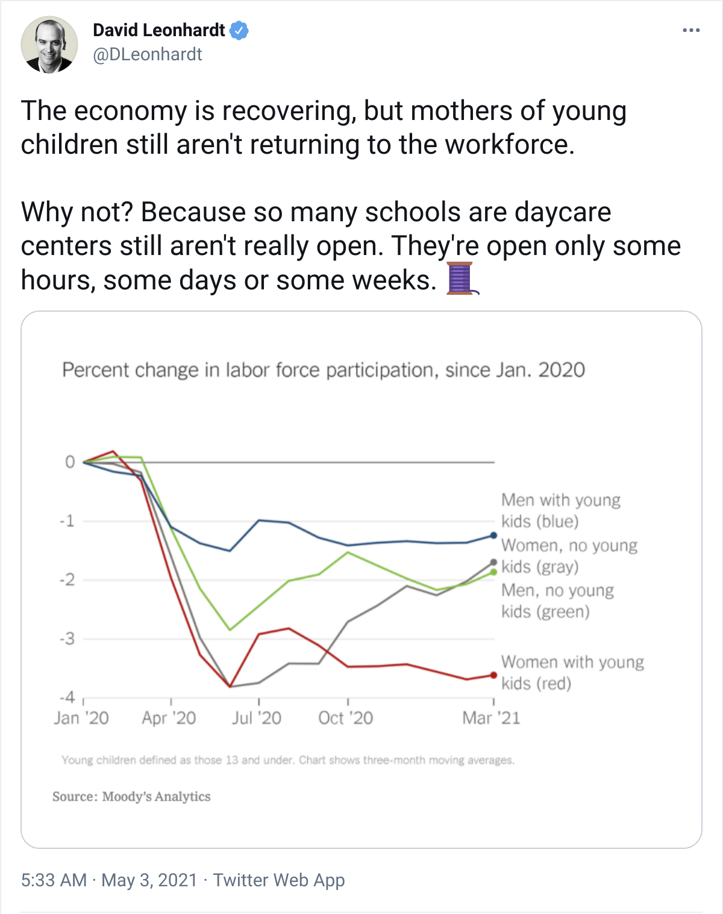
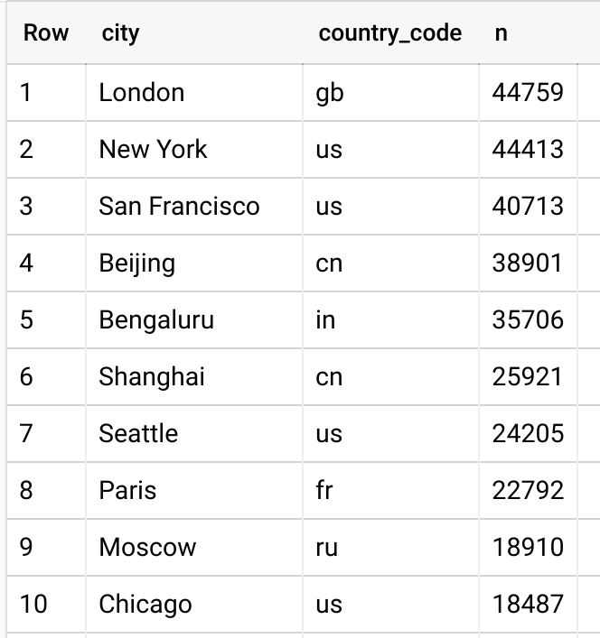
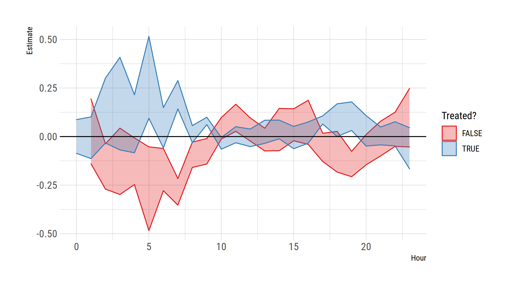

class: inverse, center, middle
name: prologue

```{css, echo=FALSE}
# CSS for including pauses in printed PDF output (see bottom of lecture)
@media print {
  .has-continuation {
    display: block !important;
  }
}
```

```{r setup, include=FALSE}
# xaringanExtra::use_scribble() ## Draw on slides. Requires dev version of xaringanExtra.

options(htmltools.dir.version = FALSE)
library(knitr)
opts_chunk$set(
  fig.align = "center",  
  fig.asp = 9/16,
  out.width = "95%",
  dpi= 300,
  cache=TRUE, 
  warning=FALSE, message=FALSE,
  echo=FALSE
  )
```

```{r libs, include=FALSE, cache=FALSE}
library(fst)
library(data.table)
library(ggplot2)
library(hrbrthemes)
theme_set(theme_ipsum_rc(plot_margin = margin(15, 15, 15, 15)))
```

```{r funcs, include=FALSE, cache=FALSE}
acols = c('events', 'users')

prop_wends = 
  function(d, highlight_year = NULL, highlight_col = NULL, ylim = NULL,
           start_week = 2, end_week = 50, treat_line = 10) {
    
    if (is.null(highlight_year)) highlight_year = 2020
    highlight_year = paste0(highlight_year)
    if (is.null(highlight_col)) highlight_col = 'dodgerblue'
    
    col_vals = c('2015' = 'grey15', '2016' = 'grey30', '2017' = 'grey45', 
                 '2018' = 'grey60', '2019' = 'grey75', '2020' = 'grey90')
    
    col_vals[highlight_year] = highlight_col
      
    if (is.null(d$location)) d$location = toupper(d$country_code)
    
    d %>%
      .[, 
        lapply(.SD, sum),
        .SDcols = acols,
        by = .(location, year(date), isoweek(date), wend = wday(date) %in% c(1, 7))] %>%
      .[, 
        c(list(wend = wend), lapply(.SD, prop.table)),
        .SDcols = acols,
        by = .(location, isoweek, year)] %>%
      .[isoweek >= start_week & isoweek<=end_week] %>%
      .[(wend)] %>% 
      ggplot(aes(isoweek, events, col = as.factor(year))) + 
      geom_line() + 
      geom_vline(xintercept = treat_line, lty = 2) + 
      labs(#title = 'Proportion of activity on weekends',
           x = 'Week of year', y = 'Proportion') +
      scale_y_percent(limits = ylim) +
      scale_colour_manual(values = col_vals) +
      theme(legend.position = 'bottom', legend.title = element_blank()) +
      facet_wrap(~ location)
    
  }


# Prop whours -------------------------------------------------------------

prop_whours = 
  function(d, highlight_year = NULL, highlight_col = NULL, ylim = NULL,
           start_week = 2, end_week = 50, treat_line = 10) {
    
    if (is.null(highlight_year)) highlight_year = 2020
    highlight_year = paste0(highlight_year)
    if (is.null(highlight_col)) highlight_col = 'dodgerblue'
    
    col_vals = c('2015' = 'grey15', '2016' = 'grey30', '2017' = 'grey45', 
                 '2018' = 'grey60', '2019' = 'grey75', '2020' = 'grey90')
    
    col_vals[highlight_year] = highlight_col
    
    if (is.null(d$location)) d$location = toupper(d$country_code)
    
    d %>%
      .[, 
        lapply(.SD, sum),
        .SDcols = acols,
        by = .(location, year(date), isoweek(date), whours = hr %in% 9:18)] %>%
      .[, 
        c(list(whours = whours), lapply(.SD, prop.table)),
        .SDcols = acols,
        by = .(location, isoweek, year)] %>%
      .[isoweek >= start_week & isoweek<=end_week] %>%
      .[!(whours)] %>% 
      ggplot(aes(isoweek, events, col = as.factor(year))) + 
      geom_line() + 
      geom_vline(xintercept = treat_line, lty = 2) + 
      labs(#title = 'Proportion of activity outside normal office hours',
           #caption = 'Office hours defined as 9 am to 6 pm.',
           x = 'Week of year', y = 'Proportion') +
      scale_y_percent(limits = ylim) +
      scale_colour_manual(values = col_vals) +
      theme(legend.position = 'bottom', legend.title = element_blank()) +
      facet_wrap(~ location)
    
  }

# Daily diff plot ----

daily_diff_plot = 
  function(data, measure = c('both', 'events', 'users'), 
           start_date = '2020-01-05', end_date = '2020-05-30',
           treat_date = NULL, hide_treated = FALSE) {
    mcols = match.arg(measure)
    if (mcols=='both') mcols = c('events', 'users')
    start_date = as.Date(start_date)
    end_date = as.Date(end_date)
    if(!is.null(treat_date)) treat_date = as.IDate(treat_date)
    ## Get the date offset for comparing year on year (i.e. match weekends with 
    ## weekends, etc.). Note that we take the median value to avoid weekday 
    ## discontinuities (i.e. start of new week in one year vs old week in 
    ## another).
    date_offset = 365 + median(wday(data$date) - wday(data$date+365)) 
    
    treat_grp = paste(unique(year(c(start_date, end_date))), collapse = '_')
    comp_grp = paste(unique(year(c(start_date, end_date)-date_offset)), collapse = '_')

    d = copy(data) %>%
      .[, c('date', 'location', ..mcols)] %>%
      melt(measure = mcols, variable = 'type', value = 'y') %>%
      .[, date_offset := date + date_offset] %>%
      melt(id.vars = c('location', 'type', 'y')) %>%
      .[value >= start_date & value <= end_date] %>%
      .[, .(y = sum(y)), by = .(location, type, variable, value)] %>% ## ICO any remaining duplicates
      dcast(location + type + value ~ variable, value.var = 'y') %>%
      .[, Difference := date - date_offset]
    d = 
      melt(d, id.vars = c('location', 'type', 'value'), value.name = 'y') %>%
      .[, grp := fifelse(variable=='date', 
                         treat_grp,  
                         fifelse(variable=='date_offset', 
                                 comp_grp, 
                                 paste(variable)))] %>%
      .[, pnl := factor(fifelse(variable=='Difference', 'diff', 'raw'), 
                        levels = c('raw', 'diff'))]
    
    col_vals = c('grey50', 'dodgerblue', 'black')
    names(col_vals) = c(comp_grp, treat_grp, 'Difference')
    
    if (hide_treated) d[value>=treat_date & grp!=comp_grp, y := NA]
    
    p =
      ggplot(d, aes(value, y, col = grp, fill = grp, group = grp)) + 
      geom_line() +
      geom_area(data = d[pnl=='diff'], alpha = 0.3, show.legend = FALSE) +
      scale_x_date(date_breaks = '1 month', date_labels = '%b') +
      scale_y_continuous(labels = scales::comma) +
      scale_colour_manual(values = col_vals, aesthetics = c('colour', 'fill')) +
      labs(y = 'Daily value') +
      theme(
        axis.title.x = element_blank(),
        legend.title = element_blank(),
        strip.text = element_blank(),
        legend.position = 'bottom'
      ) + 
      geom_vline(xintercept = treat_date, lty = 2) +
      facet_wrap(
        pnl ~ location + stringr::str_to_title(type), 
        scales = 'free_y', nrow = 2,
        labeller = labeller(pnl = function(x) gsub("diff|raw", "", x))
        )
    
    return(p)
  }

age_gender_plot = function(d, i = 'events') {
    tmp = copy(d)
    tmp =
      melt(tmp[!is.na(gender) & !is.na(age)
             ][date>="2020-02-15" & date<"2020-05-01"
               ][, 
                 lapply(.SD, sum, na.rm = TRUE), 
                 .SDcols = i, 
                 by = .(date, gender, age)
                 ], 
           id.vars = c('date', 'gender', 'age'))
    p =
      ggplot(tmp, aes(date, value)) + 
        geom_line() + 
        geom_point(data = tmp[weekdays(date) %in% c('Saturday', 'Sunday')], col = 'red') +
        facet_wrap(~age+gender, scales = "free_y", ncol = 2) +
        geom_vline(
          xintercept = as.IDate(c('2020-03-04', '2020-03-12', '2020-03-23')), 
          col = 'dodgerblue', lwd = 0.4, lty = 2
          ) + 
        labs(y = i)
      print(p)
  }
```

```{r data, include=FALSE}
ddir = path.expand('~/Documents/Papers/CovGit/covgit/data/')
g = read_fst(paste0(ddir, 'global.fst')); setDT(g)
countries = read_fst(paste0(ddir, 'countries.fst')); setDT(countries)
lon = read_fst(paste0(ddir, 'lon.fst')); setDT(lon)
nyc = read_fst(paste0(ddir, 'nyc.fst')); setDT(nyc)
sfo = read_fst(paste0(ddir, 'sfo.fst')); setDT(sfo)
bei = read_fst(paste0(ddir, 'bei.fst')); setDT(bei)
blr = read_fst(paste0(ddir, 'blr.fst')); setDT(blr)
sea = read_fst(paste0(ddir, 'sea.fst')); setDT(sea)
sea_linkedin = read_fst(paste0(ddir, 'sea-linkedin.fst')); setDT(sea_linkedin)
```


<!-- # Table of contents -->

<!-- 1. [Prologue](#prologue) -->

<!-- --- -->


# Introduction

---

# Preview

We analyse the impact of COVID-19 on tech sector productivity using data from: **GitHub** ([www.github.com](www.github.com))

- Several terabytes of data at incredibly high temporal resolution.
- For a subset of users, we are also able to match location, job description, and gender.

Main findings:

- COVID-19 led to large and distinct changes in workplace habits at the global level.
- More work online overall and more done outside of traditional office hours.
- However, global trends mask quite a lot of heterogeneity at the local level.

---

# Related literature

--
count:false

Look, there's a lot of it. _Many_ journals with COVID-19 special issues and colloquia. (E.g. [JPupE](https://www.sciencedirect.com/journal/journal-of-public-economics/special-issue/10JWB645FT5).)

--
count:false

To single out a few favourites and (most) closely related.

 Alternative data:

- Google Trends (e.g. Brodeur et. al., [JPubE 2021](https://www.sciencedirect.com/science/article/pii/S0047272720302103))
- Electricity (e.g. Cicala, [NBER WP 2020](https://www.nber.org/digest-202012/working-homes-impact-electricity-use-pandemic))
- Cellphone (e.g. Goolsbee & Syverson, [JPubE 2021](https://www.sciencedirect.com/science/article/pii/S0047272720301754); Harris, [NBER WP 2020](https://www.nber.org/papers/w28132); Bravata et. al., [NBER WP 2021](https://www.nber.org/papers/w28645))
- Consumer spending, job postings, etc. (e.g. Chetty et al., [NBER WP 2020](https://www.nber.org/papers/w27431); Forsythe et. al., [JPubE, 2021](https://www.sciencedirect.com/science/article/abs/pii/S004727272030102X))

Gendered outcomes: 

- Deryugina et al. ([AEA P&P, 2021](https://secureservercdn.net/166.62.111.84/0zv.ccf.myftpupload.com/wp-content/uploads/2021/02/NBER-Working-Paper-Deryugina_Shurchkov_Stearns_2021.pdf))
- Albanesi and Kim ([NBER WP, 2021](https://www.nber.org/papers/w28505))

Labour market adjustment and WFH: 

- Barrero et. al. ([NBER WP, 2021](https://www.nber.org/papers/w28731))
- Bartik et. al. ([PNAS, 2020](https://www.pnas.org/content/early/2020/07/09/2006991117); [Brookings, 2021](https://www.brookings.edu/wp-content/uploads/2020/06/Bartik-et-al-conference-draft.pdf); [NBER WP, 2020](https://www.nber.org/papers/w27422))

---

# Just yesterday

.pull-left[
```{r leonhardt-tweet-covid-schools-png}

```
]

.pull-right[
Source: https://twitter.com/DLeonhardt/status/1389196436177358852

Article: https://www.nytimes.com/2021/05/03/briefing/schools-reopening-working-mothers.html
]

---
class: inverse, center, middle
name: github

# GitHub

---

# What is Git(Hub)?

### Git

- A distributed version control system (created by Linus Torvalds to help manage contributions to the Linux kernel).

- "Imagine that Dropbox and the 'Track Changes' feature in MS Word had a baby. Git would be that baby."

- Git is a program that lives on your computer.

### GitHub

- Cloud service that builds on top of Git, providing an array of additional features. Easy to share and contribute to code online, host files and websites, etc.

- There are other, similar platforms. But GitHub is by far the largest.

- More than 30 million user accounts (including 2.5 million with some form of geographic identification).

---

# Data access


Live session example(s).
- [GitHub](https://github.com/grantmcdermott) | [API](https://api.github.com/users/grantmcdermott) | [BigQuery](https://console.cloud.google.com/bigquery?project=mcd-lab&p=githubarchive&d=year&t=2020&page=table)

--
count:false

Key takeaways: Git(Hub) is  version control platform that allows millions of users to carefully track and edit code.

- Activity is documented _to the second_ and logged via the GitHub API.

--
count:false

Key data sources: [GH Archive](https://www.gharchive.org/) and [GH Torrent](https://ghtorrent.org/).
- Both provide data access via Google BigQuery.

--
count:false

Our primary measure of activity is GitHub "[events](https://docs.github.com/en/developers/webhooks-and-events/github-event-types)".
- _Pushes_ (can contain multiple _commits_), _Pulls_, _Issues_, _Comments_, _Pull Requests_, etc.
- We also measure "users". How many people logged on at least once during the relevant time period (day, hour, etc.)
- Limitations: Only see public repos. Don't have geographic/demographic info for everyone (and mostly self-reported where we do).

---

# Top cities by geo-tagged users

.pull-left[
```{r top-cities-png}

```
]
.pull-right[
In the slides that follow, I'm going to focus on the top 5 plus Seattle (no. 7).
]

---
class: center, middle

(Are you ready for lots of plots?)

---
class: inverse, center, middle
name: raw

# Raw event data

---

# Global

```{r g_daily_diff}
daily_diff_plot(
    g, 
    measure = 'events',
    start_date = '2020-02-01', end_date = '2020-05-31',
    treat_date = '2020-03-15' ## Guestimate
)
```

---

# London

```{r lon_daily_diff}
daily_diff_plot(measure = 'events',
    lon[, lapply(.SD, sum), .SDcols = c('events', 'users'), by = .(date, location)], 
    start_date = '2020-02-01', end_date = '2020-05-31',
    treat_date = '2020-03-23' ## National stay at home order
)
```

---

# NYC

```{r nyc_daily_diff}
daily_diff_plot(measure = 'events',
    nyc[, lapply(.SD, sum), .SDcols = c('events', 'users'), by = .(date, location)], 
    start_date = '2020-02-01', end_date = '2020-05-31',
    treat_date = '2020-03-22' ## New York State on PAUSE
)
```

---

# SFO

```{r sfo_daily_diff}
daily_diff_plot(measure = 'events',
    sfo[, lapply(.SD, sum), .SDcols = c('events', 'users'), by = .(date, location)], 
    start_date = '2020-02-01', end_date = '2020-05-31',
    treat_date = '2020-03-19' ## State-wide shelter-in-place order
)
```

---

# Beijing

```{r bei_daily_diff}
daily_diff_plot(measure = 'events',
    bei[, lapply(.SD, sum), .SDcols = c('events', 'users'), by = .(date, location)], 
    start_date = '2019-12-01', end_date = '2020-03-31',
    treat_date = '2020-02-10' ## Shelter-in-place order
)
```


---

# Bengalaru

```{r blr_daily_diff}
daily_diff_plot(measure = 'events',
    blr[, lapply(.SD, sum), .SDcols = c('events', 'users'), by = .(date, location)], 
    start_date = '2020-02-01', end_date = '2020-05-31',
    treat_date = '2020-03-24' ## Nationwide lockdown (slowly phased out from May 30)
)
```


---
class: inverse, center, middle
name: reallocation

# Labour reallocation

---
# Global activity on weekends

```{r g_prop_wends_guess}
prop_wends(g, highlight_col = NA, ylim = c(0.15, 0.25))
```

---
count: false

# Global activity on weekends

```{r g_prop_wends}
prop_wends(g, ylim = c(0.15, 0.25))
```

---
name: cities

# Cities

Okay, so a big shift in work habits at the global level.

What about individual cities?

- Let's take a look.

--
count:false

At the same time, for users in a common geography/timezone, we can drill down further to look at labour reallocation *within a day*.

- Are people working more outside of regular work hours? (Here: defined as **9 am to 6 pm**.)

---

# London: Activity on weekends

```{r lon_prop_wends_guess}
prop_wends(
    lon[year(date)>=2017], highlight_col = NA,
    ylim = c(0.10, 0.25), 
    treat_line = isoweek(as.Date('2020-03-23'))-1
    )
```

---
count: false

# London: Activity on weekends

```{r lon_prop_wends}
prop_wends(
    lon[year(date)>=2017],
    ylim = c(0.10, 0.25), 
    treat_line = isoweek(as.Date('2020-03-23'))-1
    )
```

---

# London: Activity outside office hours

```{r lon_prop_whours_guess}
prop_whours(lon[year(date)>=2017], highlight_col = NA,
            treat_line = isoweek(as.Date('2020-03-23'))-1)
```

---
count: false

# London: Activity outside office hours

```{r lon_prop_whours}
prop_whours(lon[year(date)>=2017],
            treat_line = isoweek(as.Date('2020-03-23'))-1)
```

---

# Beijing: Activity on weekends

```{r bei_prop_wends_guess}
prop_wends(
    bei[year(date)>=2017], highlight_col = NA,
    ylim = c(0.10, 0.35), 
    treat_line = isoweek(as.Date('2020-02-10'))-1
    )
```

---
count: false

# Beijing: Activity on weekends

```{r bei_prop_wends}
prop_wends(
    bei[year(date)>=2017],
    ylim = c(0.10, 0.35), 
    treat_line = isoweek(as.Date('2020-02-10'))-1
    )
```

---

# Beijing: Activity outside office hours

```{r bei_prop_whours_guess}
prop_whours(
  bei[year(date)>=2017], highlight_col = NA,
  treat_line = isoweek(as.Date('2020-02-10'))-1
  )
```

---
count: false

# Beijing: Activity outside office hours

```{r bei_prop_whours}
prop_whours(
  bei[year(date)>=2017],
  treat_line = isoweek(as.Date('2020-02-10'))-1
  )
```

---

# Bengaluru: Activity on weekends

```{r blr_prop_wends_guess}
prop_wends(
    blr[year(date)>=2017], highlight_col = NA,
    ylim = c(0.15, 0.30),
    treat_line = isoweek(as.Date('2020-03-24'))-1
    )
```

---
count: false

# Bengaluru: Activity on weekends

```{r blr_prop_wends}
prop_wends(
    blr[year(date)>=2017],
    ylim = c(0.15, 0.30),
    treat_line = isoweek(as.Date('2020-03-24'))-1
    )
```

---

# Bengaluru: Activity outside office hours

```{r blr_prop_whours_guess}
prop_whours(
  blr[year(date)>=2017], highlight_col = NA,
  treat_line = isoweek(as.Date('2020-03-24'))-1
  )
```

---
count: false

# Bengaluru: Activity outside office hours

```{r blr_prop_whours}
prop_whours(
  blr[year(date)>=2017],
  treat_line = isoweek(as.Date('2020-03-24'))-1
  )
```

---

# US tech Hubs: Activity on weekends

```{r cities_prop_wends_guess}
prop_wends(
  rbind(nyc, sea, sfo)[year(date)>=2017],
  ylim = c(0.10, 0.25), highlight_col = NA, treat_line = NULL
)
```

---

# US tech hubs: Activity outside office hours

```{r cities_prop_whours}
prop_whours(rbind(nyc, sea, sfo)[year(date)>=2017], 
            highlight_col = NA, treat_line = NULL)
```

---

# NYC: Activity on weekends

```{r nyc_prop_wends_guess}
prop_wends(
  nyc[year(date)>=2017],
  ylim = c(0.15, 0.25), highlight_col = NA,
  treat_line = isoweek(as.Date('2020-03-22'))-1
)
```

---
count: false

# NYC: Activity on weekends

```{r nyc_prop_wends}
prop_wends(
  nyc[year(date)>=2017],
  ylim = c(0.15, 0.25),
  treat_line = isoweek(as.Date('2020-03-22'))-1
)
```

---

# NYC: Activity outside office hours

```{r nyc_prop_whours_guess}
prop_whours(
  nyc[year(date)>=2017], highlight_col = NA,
  treat_line = isoweek(as.Date('2020-03-22'))-1
  )
```

---
count: false

# NYC: Activity outside office hours

```{r nyc_prop_whours}
prop_whours(
  nyc[year(date)>=2017],
  treat_line = isoweek(as.Date('2020-03-22'))-1
  )
```

---

# SFO: Activity on weekends

```{r sfo_prop_wends_guess}
prop_wends(
  sfo[year(date)>=2017],
  ylim = c(0.12, 0.22), 
  highlight_col = NA,
  treat_line = isoweek(as.Date('2020-03-19'))-1
)
```

---
count: false

# SFO: Activity on weekends

```{r sfo_prop_wends}
prop_wends(
  sfo[year(date)>=2017],
  ylim = c(0.12, 0.22),
  treat_line = isoweek(as.Date('2020-03-19'))-1
)
```

---

# SFO: Activity outside office hours

```{r sfo_prop_whours_guess}
prop_whours(
  sfo[year(date)>=2017], highlight_col = NA,
  treat_line = isoweek(as.Date('2020-03-19'))-1
)
```

---
count: false

# SFO: Activity outside office hours

```{r sfo_prop_whours}
prop_whours(
  sfo[year(date)>=2017],
  treat_line = isoweek(as.Date('2020-03-19'))-1
)
```

---

# SEA: Activity on weekends

```{r sea_prop_wends_guess}
prop_wends(
  sea[year(date)>=2017],
  #ylim = c(0.12, 0.22), 
  highlight_col = NA,
  treat_line = isoweek(as.Date('2020-03-04'))-1
)
```

---
count: false

# SEA: Activity on weekends

```{r sea_prop_wends}
prop_wends(
  sea[year(date)>=2017],
  treat_line = isoweek(as.Date('2020-03-04'))-1
)
```

---

# SEA: Activity outside office hours

```{r sea_prop_whours_guess}
prop_whours(
  sea[year(date)>=2017], highlight_col = NA,
  treat_line = isoweek(as.Date('2020-03-04'))-1
  )
```

---
count: false

# SEA: Activity outside office hours

```{r sea_prop_whours}
prop_whours(
  sea[year(date)>=2017],
  treat_line = isoweek(as.Date('2020-03-04'))-1
  )
```

---
class: inverse, center, middle
name: demographics

# User demographics

---

# GitHub 🤝 LinkedIn

```{r github-linkedin-png}

```

---

# A Pyrrhic victory

```{r eff-hiq-vs-linkedin-png}

```

---

# Matched dataset for Seattle GitHub + Linkedin users

After some very tedious webscraping, we match about **1,800** Seattle GitHub users
to their LinkedIn profiles.

Impute age based on education (degree and attendance dates).

- `<30` (16%)
- `30--39` (26%)
- `40--49` (14%)
- `>50` (7%)
- Unmatched (38%)

Impute gender using a mix of automated name-matching (good for Anglo names) and grad student crowd-sourcing (good for non-Anglo names).
- `male` (90%)
- `female` (7%)
- Unmatched (3%)

--

In the plots that follow, I'm going to mark three "treatment" dates: 1) Microsoft and Amazon mandate remote work, 2) school closures, and 3) mayoral stay-at-home order.

---

# Age × gender effects: males, under 30

```{r age_gender_mu30}
age_gender_plot(sea_linkedin[gender=='male' & age=='<30'])
```

---

# Age × gender effects: females, under 30

```{r age_gender_fu30}
age_gender_plot(sea_linkedin[gender=='female' & age=='<30'])
```

---

# Age × gender effects: males, 30--39

```{r age_gender_m30_39}
age_gender_plot(sea_linkedin[gender=='male' & age=='30--39'])
```

---

# Age × gender effects: females, 30--39

```{r age_gender_f30_39}
age_gender_plot(sea_linkedin[gender=='female' & age=='30--39'])
```

---

# Age × gender effects: males, 40--49

```{r age_gender_m40_49}
age_gender_plot(sea_linkedin[gender=='male' & age=='40--49'])
```

---

# Age × gender effects: females, 40--49

```{r age_gender_f40_49}
age_gender_plot(sea_linkedin[gender=='female' & age=='40--49'])
```

---
class: inverse, center, middle
name: conclusion

# Conclusions

---

# Aside: DiD example (London time of day)

```{r lon-did-png}

```

---

# Conclusions

We use a ~~novel~~ criminally underused observational dataset from the tech sector: **GitHub** ([www.github.com](www.github.com))

- The first of (hopefully) many projects using these data.

We see a pronounced reallocation of work habits at the global level.

- Overall increase in activity and more work on weekends.
- These trends persist for most of 2021, although some reversion to baseline.

Global trends mask considerable heterogeneity at the local level.

- Generally coincide with local lockdowns and remote work mandates, but different work "cultures" and demographic features yield differential results.... sometimes of the opposing sign.

Panel-based analysis is potentially complicated (SUTVA violations), although year-on-year and BSTS comparisons confirm what is directly observable in the data.

```{r gen_pdf, include = FALSE, cache = FALSE, eval = FALSE}
infile = list.files(pattern = '.html')
pagedown::chrome_print(input = infile, timeout = 100)
```